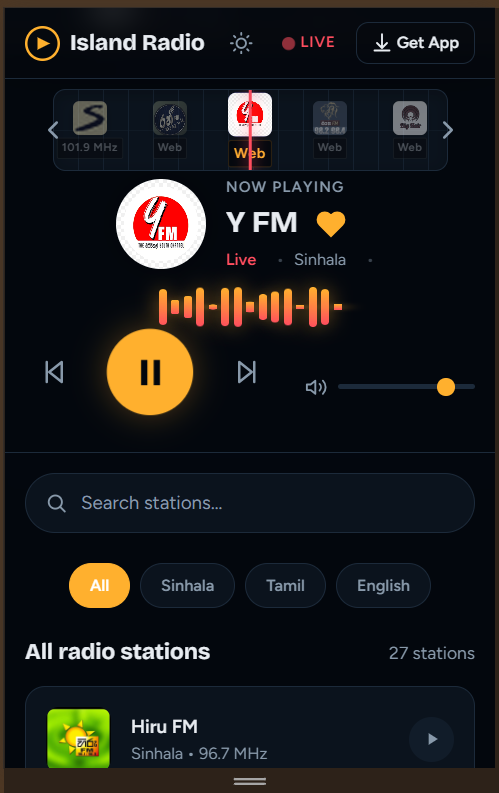
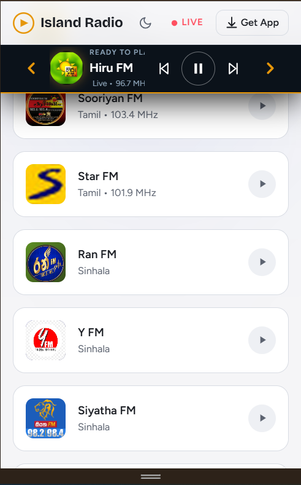
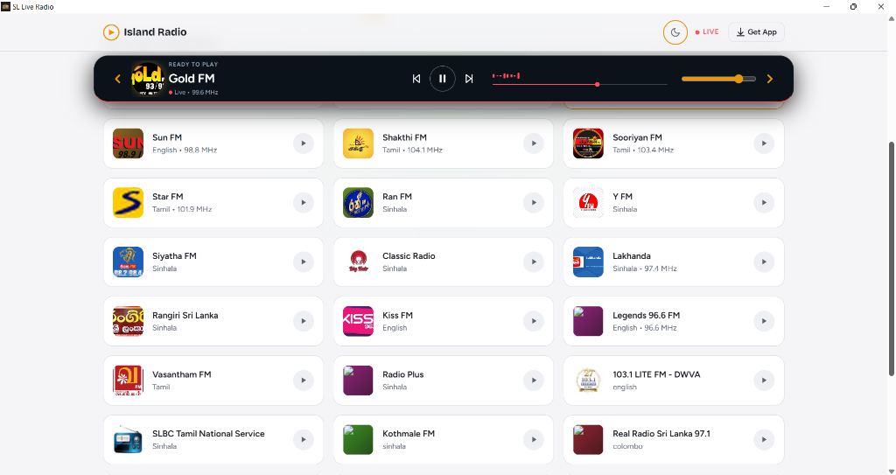

# 📻 Island Radio

<p align="center">
  
  
  
  
  
</p>

<p align="center">
  
  
  
  
</p>

<p align="center">
  <strong>A modern, lightweight, and high-performance live radio streaming web application tailored for Sri Lankan online radio stations.</strong><br>
  Built from the ground up with a <em>mobile-first</em>, ultra-responsive design for seamless listening anywhere, on any device.
</p>

<p align="center">
  <a href="https://sl-live-radio-app.vercel.app"><strong>🌐 Try Live Demo</strong></a> • 
  <a href="https://raveenjk.itch.io/island-radio"><strong>💻 Download Desktop App (itch.io)</strong></a>
</p>

---

## 📱 Mobile-First & User-Friendly Interface

Island Radio is engineered specifically to provide a smooth, app-like experience straight from your mobile browser without installing anything:

* **📲 Responsive Mobile Layout:** Automatically adapts to any screen size, whether you're using a smartphone, tablet, or desktop monitor.
* **🎵 Sticky Mini-Player:** On mobile screens, the player collapses into an ergonomic bottom mini-player so it never blocks station browsing.
* **👆 Smooth Touch Controls:** Swiping carousel tuner and instant tap-to-play optimized for one-handed mobile use.
* **⚡ Ultra Fast & Lightweight:** Zero external frameworks or heavy libraries. Instant loading even on 3G/4G mobile connections with minimal battery usage.

---

## 📸 Screenshots & Previews

<div align="center">

### 🌐 Web View


---

### 📱 Mobile Responsive View (Dark & Light Mode)

<p align="center">
  
  &nbsp;&nbsp;
  
</p>

---

### 🖥️ Desktop Standalone App



</div>

---

## ✨ Features

- **📻 Retro Swiping Tuner:** Browse and discover active stations via a snappy, horizontal dragging carousel reminiscent of an analog radio tuner.
- **📊 Dynamic Sound Visualizer:** Integrated CSS-driven graphic EQ sound wave that pulses dynamically alongside active playback.
- **🌓 Light & Dark Theme:** System-level automatic dark/light theme detection with manual toggle option saved in LocalStorage.
- **🔍 Quick Station Search:** Instant filtering to find your favorite Sinhala, Tamil, and English stations in seconds.
- **🌐 Global High-Quality Streams:** Direct, secure HD audio streams curated from reliable open radio registries.
- **🚀 Zero Dependencies:** Crafted with pure Vanilla HTML5, CSS3, and modern ES6 JavaScript. No Node.js build steps needed for the web app.

---

## 🛠️ Languages & Technologies Used

Island Radio is built using modern web standards for its core streaming platform, complemented by two dedicated desktop client architectures (Electron.js & Python):

### 🌐 1. Web Application (Core Frontend)
* **HTML5:**
  - Semantic markup for clean layout, structure, and accessibility.
  - Native `<audio>` stream handling and custom vector SVG icons.
* **CSS3 (Modern CSS):**
  - **CSS Custom Properties (Variables):** Powering seamless real-time Dark / Light theme toggling without page reload.
  - **CSS Grid & Flexbox:** Ensuring fluid, pixel-perfect responsive layouts across mobile, tablet, and desktop viewports.
  - **CSS Keyframes & Transforms:** High-performance hardware-accelerated sound wave visualizer and carousel slide animations.
* **JavaScript (Vanilla ES6+):**
  - **HTML5 Web Audio API:** Direct stream consumption, playback lifecycle, buffering management, and volume normalization.
  - **Fetch API:** Asynchronous retrieval and parsing of station metadata from `stations.json`.
  - **LocalStorage API:** Persisting user preferences (such as selected theme and favorite stations) client-side with zero latency.
  - **Modular Architecture:** Clean separation of concerns (`player.js`, `browse.js`, `store.js`, `main.js`) with **zero external JS dependencies or bloated npm packages**.
* **JSON:**
  - Structured storage for station streams, logos, genre tags, and frequency metadata (`data/stations.json`).

---

### 🖥️ 2. Desktop Application (Multi-Engine Implementations)

#### 🐍 Python Lightweight Client (`desktop/python_desktop/`)
* **Python 3:**
  - **`pywebview`:** Renders the web interface using the system's native Microsoft Edge WebView2 engine, offering near-instant startup and significantly lower RAM usage compared to typical Chromium wrappers.
  - **`ctypes` (Win32 API):** Interacts directly with Windows `user32.dll` to manage frameless window styles, compact floating mini-player mode, and "Always on Top" pinning.
  - **`PyInstaller`:** Compiles the Python application into a standalone, portable `.exe` binary distributed on itch.io.

---

## 🚀 Getting Started (Local Setup)

### 🌐 Running the Web App

Since **Island Radio** uses pure native web technologies, no installation or npm setup is required:

1. **Clone the repository:**
   ```bash
   git clone https://github.com/raveenjk/sl-live-radio-app.git
   ```

2. **Open the project:**
   Simply double-click `index.html` to open it in any web browser, or use VS Code's **Live Server** extension.

3. **Enjoy Listening:**
   Pick your favorite station and enjoy high-definition live Sri Lankan radio!

---

### 🖥️ Running the Desktop Clients (Optional)

* **Run Electron Client:**
  ```bash
  cd desktop/desktop
  npm install
  npm start
  ```

* **Run Python Client:**
  ```bash
  cd desktop/python_desktop
  python main.py
  ```

---

## 📁 Project Structure

```text
├── index.html           # Main Web Application Entrypoint
├── data/
│   └── stations.json    # Radio station list, stream URLs & metadata
├── css/
│   ├── base.css         # Theme variables, colors & typography
│   ├── browse.css       # Search bar & station grid layout
│   └── player.css       # Audio player, audio wave visualizer & tuner
├── js/
│   ├── main.js          # App lifecycle & event bindings
│   ├── player.js        # HTML5 Audio engine & playback state
│   ├── store.js         # LocalStorage preferences manager
│   └── browse.js        # Search & station filtering logic
├── pages/
│   ├── download.html    # App download links (itch.io, App Store, Play Store)
│   └── privacy.html     # Privacy policy page
├── screenshots/         # Preview images for README documentation
└── desktop/
    ├── desktop/         # Electron.js desktop client (Node.js, electron-builder)
    └── python_desktop/  # Python lightweight desktop client (pywebview, PyInstaller)
```

---

## 🤝 Contributing

Suggestions, bug reports, and station additions are always welcome! Feel free to open an issue or submit a pull request on the [Issues page](https://github.com/raveenjk/sl-live-radio-app/issues).

---

## 📝 License

This project is licensed under the [MIT License](LICENSE).

---

## 👨‍💻 Author & Connect

Developed with ❤️ by **Raveen Madhawa**

<a href="https://www.linkedin.com/in/raveenmadhawa/" target="_blank">
  
</a>
