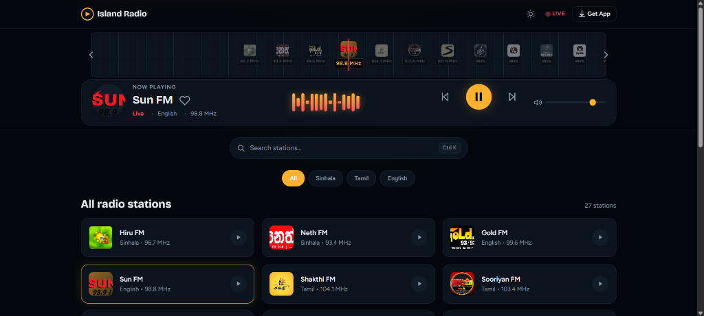

# 📻 Island Radio

<p align="center">
  
  
  
  
</p>

<p align="center">
  <strong>A modern, lightweight, and high-performance live radio streaming web application tailored for Sri Lankan online radio stations.</strong><br>
  Built from the ground up with a <em>mobile-first</em>, ultra-responsive design for seamless listening anywhere, on any device.
</p>

<p align="center">
  <a href="https://sl-live-radio-app.vercel.app"><strong>🌐 Try Live Demo</strong></a> • 
  <a href="https://raveenjk.itch.io/island-radio"><strong>💻 Download Desktop App (itch.io)</strong></a>
</p>

---

## 📱 Mobile-First & User-Friendly Interface

Island Radio is engineered specifically to provide a smooth, app-like experience straight from your mobile browser without installing anything:

* **📲 Responsive Mobile Layout:** Automatically adapts to any screen size, whether you're using a smartphone, tablet, or desktop monitor.
* **🎵 Sticky Mini-Player:** On mobile screens, the player collapses into an ergonomic bottom mini-player so it never blocks station browsing.
* **👆 Smooth Touch Controls:** Swiping carousel tuner and instant tap-to-play optimized for one-handed mobile use.
* **⚡ Ultra Fast & Lightweight:** Zero external frameworks or heavy libraries. Instant loading even on 3G/4G mobile connections with minimal battery usage.

---

## 📸 Screenshots & Previews

<!-- Replace placeholder image paths with your actual screenshot files when ready -->

<div align="center">

### 🌐 Web & Desktop View



---

### 📱 Mobile Responsive View
```
(Add your Mobile Web Screenshot here)
```
 -->

---

### 🖥️ Desktop Standalone App
```
(Add your Desktop App Screenshot here)
```
<!-- Example:  -->

</div>

---

## ✨ Features

- **📻 Retro Swiping Tuner:** Browse and discover active stations via a snappy, horizontal dragging carousel reminiscent of an analog radio tuner.
- **📊 Dynamic Sound Visualizer:** Integrated CSS-driven graphic EQ sound wave that pulses dynamically alongside active playback.
- **🌓 Light & Dark Theme:** System-level automatic dark/light theme detection with manual toggle option saved in LocalStorage.
- **🔍 Quick Station Search:** Instant filtering to find your favorite Sinhala, Tamil, and English stations in seconds.
- **🌐 Global High-Quality Streams:** Direct, secure HD audio streams curated from reliable open radio registries.
- **🚀 Zero Dependencies:** Crafted with pure Vanilla HTML5, CSS3, and modern ES6 JavaScript. No Node.js build steps needed.

---

## 🚀 Quick Start (Local Setup)

Since **Island Radio** uses pure native web technologies, no installation or npm setup is required:

1. **Clone the repository:**
   ```bash
   git clone https://github.com/raveenjk/sl-live-radio-app.git
   ```

2. **Open the project:**
   Simply double-click `index.html` to open it in any web browser, or use VS Code's **Live Server** extension.

3. **Enjoy Listening:**
   Pick your favorite station and enjoy high-definition live Sri Lankan radio!

---

## 📁 Project Structure

```text
├── index.html           # Main Application Entrypoint
├── data/
│   └── stations.json    # Radio station list, stream URLs & metadata
├── css/
│   ├── base.css         # Theme variables, colors & typography
│   ├── browse.css       # Search bar & station grid layout
│   └── player.css       # Audio player, audio wave visualizer & tuner
├── js/
│   ├── main.js          # App lifecycle & event bindings
│   ├── player.js        # HTML5 Audio engine & playback state
│   ├── store.js         # LocalStorage preferences manager
│   └── browse.js        # Search & station filtering logic
├── pages/
│   └── download.html    # App download links (itch.io, App Store, Play Store)
└── desktop/             # Desktop application build files
```

---

## 🛠️ Built With

- **HTML5:** Clean, accessible semantic elements.
- **CSS3:** Native CSS custom properties, flexbox/grid, and fluid typography.
- **Vanilla JavaScript (ES6+):** Modular code structure utilizing the native HTML5 Web Audio API.

---

## 🤝 Contributing

Suggestions, bug reports, and station additions are always welcome! Feel free to open an issue or submit a pull request on the [Issues page](https://github.com/raveenjk/sl-live-radio-app/issues).

---

## 📝 License

This project is licensed under the [MIT License](LICENSE).

---

## 👨‍💻 Author & Connect

Developed with ❤️ by **Raveen Madhawa**

<a href="https://www.linkedin.com/in/raveenmadhawa/" target="_blank">
  
</a>
